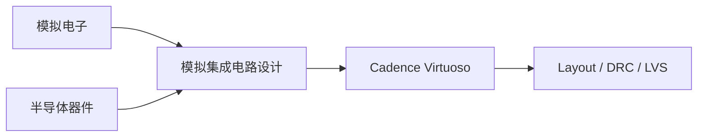

# 模拟 IC

模拟 IC 是公认**陡峭但回报极高**的方向：电源、ADC/DAC、PLL、SerDes、射频、MEMS 接口、传感器调理…… 所有"和真实世界打交道的接口"都需要模拟设计。

## 学习路径建议

## 本章内容

- [模拟集成电路设计](analog_ic_design.md) — 系统教材与课程
- [Cadence Virtuoso 入门](cadence.md) — 业界标准工具

## 学习建议

!!! warning "心理准备"
    模拟方向需要**长时间投入**。一般要走完模电 → Razavi → Tapeout 一颗芯片，才算入门。
    如果对物理与电路分析有热情，且能享受"反复 debug 几个月"的过程，那这个方向非常适合。
