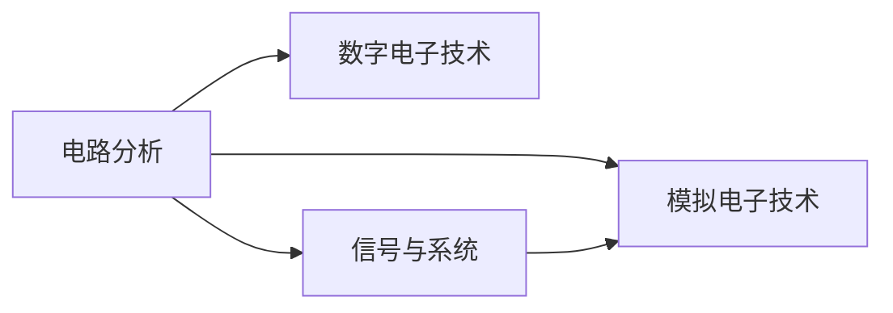

# 电路与信号

这是微电子专业的**核心基础**。所有 IC 设计的工作都建立在电路理论与信号系统之上。

## 学习路径建议

## 本章内容

- [电路分析](circuit_analysis.md) — KVL/KCL、戴维南/诺顿、暂态/正弦稳态
- [模拟电子技术](analog_electronics.md) — 二极管、BJT、MOSFET、运放
- [数字电子技术](digital_electronics.md) — 逻辑门、组合/时序电路
- [信号与系统](signals_systems.md) — 傅里叶/拉普拉斯/Z 变换、卷积、滤波器

## 学习建议

!!! warning "重点提醒"
    电路分析、模电、信号与系统是**所有方向都绕不过去**的三门课，请务必扎实。
    数电相对简单但要打好 Verilog / 数字 IC 的基础。
