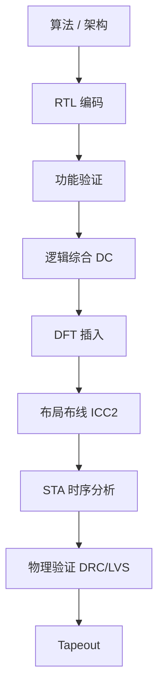

# 数字 IC 设计流程

> 状态：🚧 整理中

## 流程概览

## 推荐教材

- **《Digital Integrated Circuits》** — Rabaey
- **《Static Timing Analysis for Nanometer Designs》** — Bhasker
- **《CMOS VLSI Design》** — Weste / Harris

## 关键工具

| 阶段 | 商用工具 | 开源替代 |
| --- | --- | --- |
| 综合 | Synopsys Design Compiler | Yosys |
| PnR | Synopsys ICC2 / Cadence Innovus | OpenROAD |
| STA | Synopsys PrimeTime | OpenSTA |
| 仿真 | Synopsys VCS / Cadence Xcelium | Verilator / Icarus |
| LVS/DRC | Mentor Calibre | Magic / KLayout |

## 学习要点

- [ ] STA：建立时间 / 保持时间、时序路径分类
- [ ] 综合约束（SDC）
- [ ] 跨时钟域处理（CDC）
- [ ] 低功耗设计（UPF / Power Gating）
- [ ] DFT：扫描链、BIST
