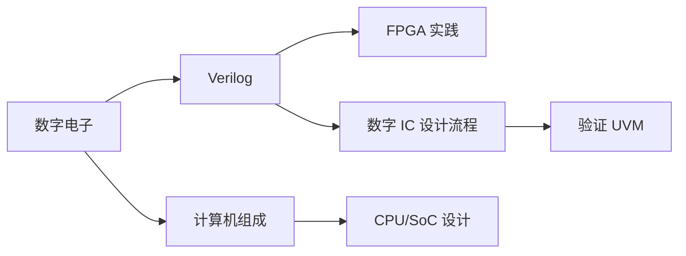

# 数字 IC

数字 IC 设计是当前就业最广、岗位最多的方向之一。从 RTL 编码到验证、综合、PnR、签核，是一整条流水线。

## 学习路径建议

## 本章内容

- [Verilog / SystemVerilog](verilog.md) — RTL 编码语言
- [计算机组成原理](computer_organization.md) — CPU / Cache / 总线
- [数字 IC 设计流程](design_flow.md) — 综合 / DFT / PnR / Signoff
- [验证 (UVM)](verification.md) — 验证方法学
- [FPGA 与 Vivado](fpga.md) — 低成本上手数字硬件

## 学习建议

!!! example "推荐路线"
    1. 先把 Verilog 和数电学透
    2. 用 FPGA 做几个小项目（流水灯 → UART → 简易 CPU）
    3. 学计算机组成原理 → 实现一个 RISC-V 单周期/流水线 CPU
    4. 接触前后端工具链：Synopsys DC / ICC2 或开源 Yosys / OpenROAD
