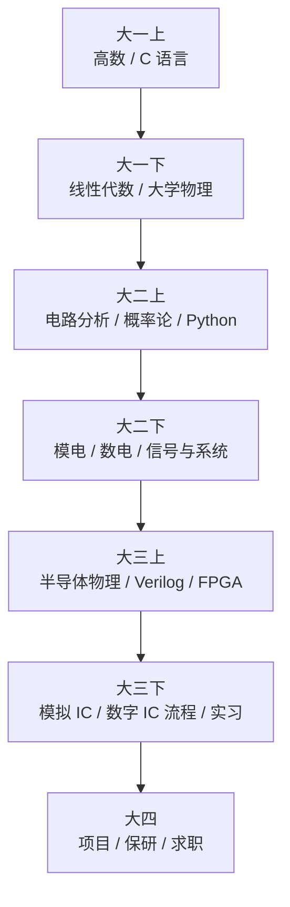

---
hide:
  - navigation
---

# 微电子自学指南

> 一份面向**微电子 / 集成电路**方向同学的自学路线，由一位还在路上的大一学生持续更新。

---

## 这是什么

这是一份模仿 [csdiy.wiki](https://csdiy.wiki) 、基于我个人自学经验整理的微电子方向学习指南。
它既是给同方向同学的参考路线，也是我自己的成长记录与反思。

哪怕这份指南只对你有一点点启发，都是对我极大的鼓励。

## 谁会从中受益

- :material-school: **微电子 / 集成电路 / 电子科学与技术** 在读本科生
- :material-account-search: **想转入芯片方向** 的相关专业（自动化、通信、计算机、物理等）同学
- :material-rocket-launch: **对 IC 行业感兴趣**、希望了解需要点什么技能树的人

## 全站地图

-   :material-function-variant: **[数学基础](math/index.md)**

    ---

    微积分、线性代数、概率论、复变 —— 一切定量分析的语言

-   :material-atom: **[物理基础](physics/index.md)**

    ---

    大学物理、电磁学、量子力学 —— 通往半导体物理的桥梁

-   :material-sine-wave: **[电路与信号](circuit/index.md)**

    ---

    电路分析、模电、数电、信号与系统 —— 专业三大基础课

-   :material-chip: **[半导体与器件](semiconductor/index.md)**

    ---

    半导体物理、器件、IC 工艺 —— 理解一颗芯片是怎么造出来的

-   :material-memory: **[数字 IC](digital_ic/index.md)**

    ---

    Verilog / 验证 / 综合 / FPGA —— 当下就业最广的方向

-   :material-waveform: **[模拟 IC](analog_ic/index.md)**

    ---

    Razavi / Cadence / 数据转换器 —— 陡峭但回报极高

-   :material-language-cpp: **[编程入门](cs/index.md)**

    ---

    C/C++ 与 Python —— 微电子人也要会写代码

-   :material-tools: **[工具与环境](tools/index.md)**

    ---

    Linux / Git / Vim / LaTeX / Tcl —— 工程师的效率倍增器

-   :material-briefcase-search: **[科研与求职](career/index.md)**

    ---

    论文检索、英语、实习与保研 —— 别让信息差耽误你

## 推荐学习路线（按学期粗略对照）

!!! note "并不是唯一答案"
    每个学校课程安排不同，这只是一个**参考时间锚**。
    重要的是：**早一点看见全貌**，避免学某门课时不知道它在整张地图的什么位置。

## 如何使用本站

1. **先看全图**：浏览左侧导航，了解微电子的知识树
2. **按章细读**：每章页都有"教材 + 网课 + 学习要点 + 与微电子的衔接"四块
3. **顺手贡献**：发现错误或想补充内容，点页面右上 :material-pencil: 直接 PR

## 关于作者

我是一名来自复旦大学的大一学生，正在学习这条路上的每一个章节。
这份指南会和我一起成长 —— 你看到的内容多半来自我刚学完不久的真实体验。

- :material-github: GitHub: [@sjy0630](https://github.com/sjy0630)
- :material-email: 邮箱: jiangyusu25@m.fudan.edu.cn
- :material-message: 反馈: [GitHub Issues](https://github.com/sjy0630/wdzdiy/issues)

## 致谢

灵感与结构借鉴：

- [CSDIY](https://csdiy.wiki) — 梦开始的地方
- [OI Wiki](https://oi-wiki.org)
- [一生一芯计划](https://ysyx.oscc.cc/)
