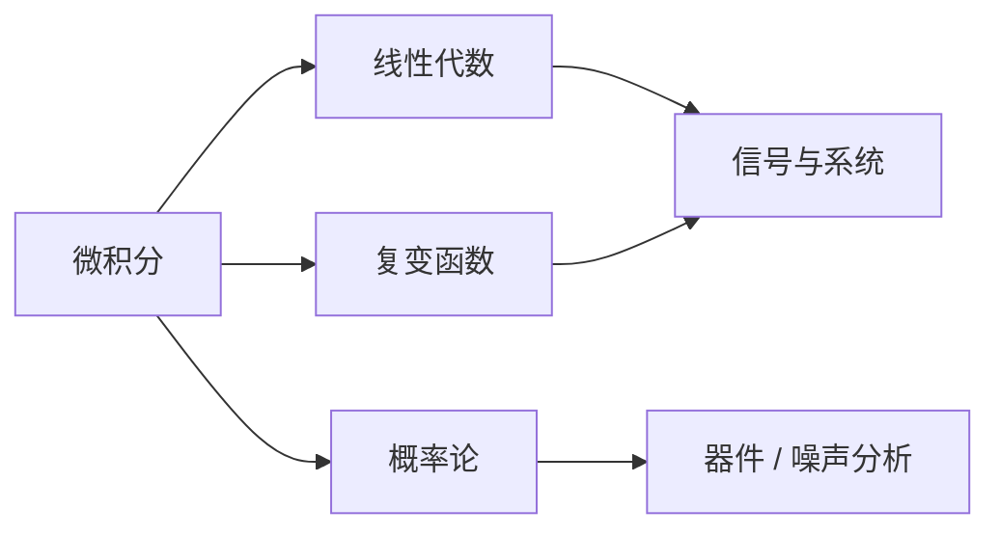

# 数学基础

数学是微电子领域所有定量分析的语言，无论是器件物理里的载流子输运方程、信号与系统里的傅里叶/拉普拉斯变换、还是 IC 设计里随机过程的噪声分析，都建立在扎实的数学基础之上。

## 学习路径建议

## 本章内容

- [微积分](calculus.md) — 一元/多元微积分、级数、ODE
- [线性代数](linear_algebra.md) — 向量空间、矩阵分解、特征值
- [概率论与数理统计](probability.md) — 随机变量、随机过程、参数估计
- [复变函数](complex_analysis.md) — 解析函数、留数定理、Z 变换基础

## 学习建议

!!! tip "微电子方向的取舍"
    - **必须扎实**：微积分、线性代数（贯穿所有专业课）
    - **务必掌握**：复变（信号与系统、电磁场、电路网络分析）
    - **建议精通**：概率论（噪声、工艺偏差、模拟设计核心概念）
