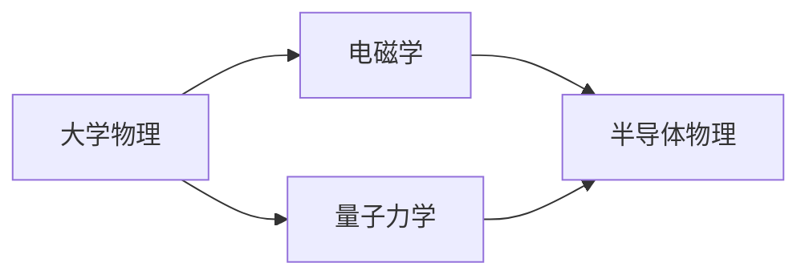

# 物理基础

微电子是一门**物理驱动**的工程学科：器件物理来自半导体物理，半导体物理来自固体物理，固体物理又来自量子力学和统计力学。

## 学习路径建议

## 本章内容

- [大学物理](general_physics.md) — 力学、热学、光学、近代物理基础
- [电磁学](electromagnetism.md) — 静电、静磁、Maxwell 方程
- [量子力学](quantum_mechanics.md) — 量子态、薛定谔方程、能带

## 学习建议

!!! info "深度建议"
    - **大学物理**：完成普通物理课程即可，不必深究
    - **电磁学**：必须掌握 Maxwell 方程组，这是理解高频电路、电磁兼容、互连寄生的基础
    - **量子力学**：要做模拟 IC / 器件方向，建议至少看到能带理论
